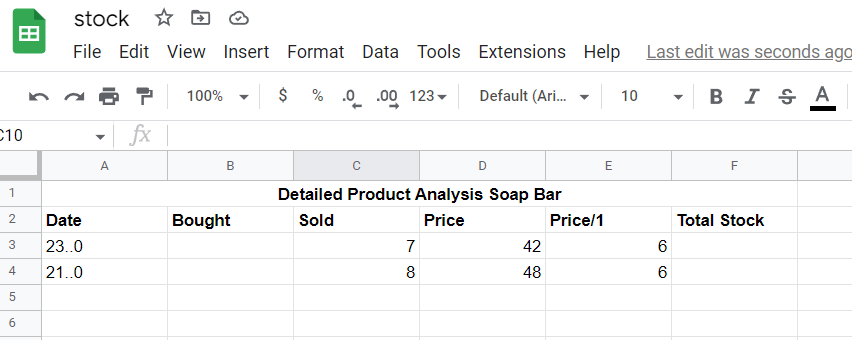
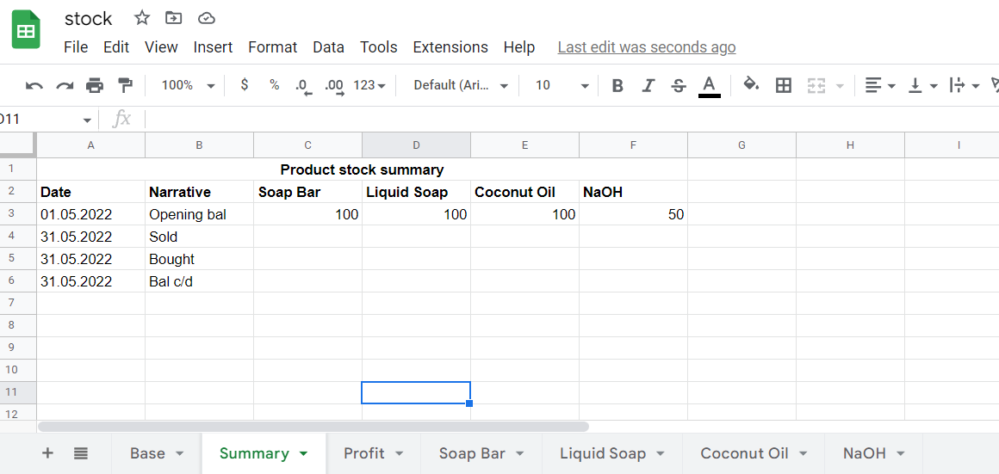
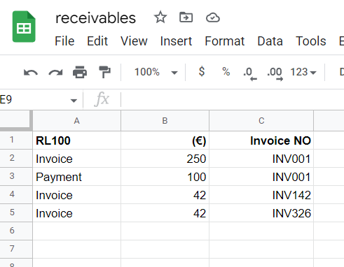
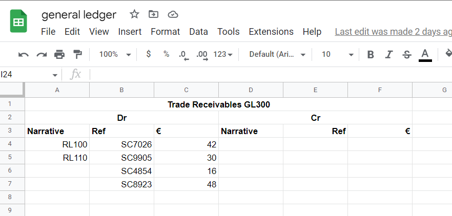
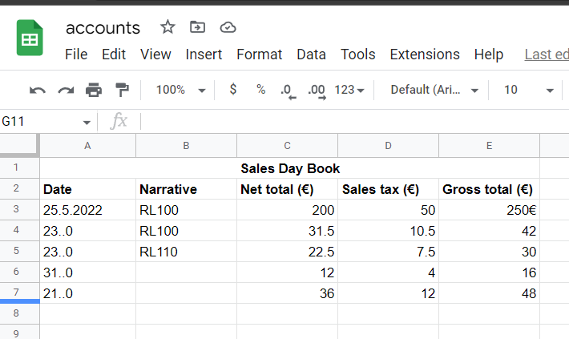
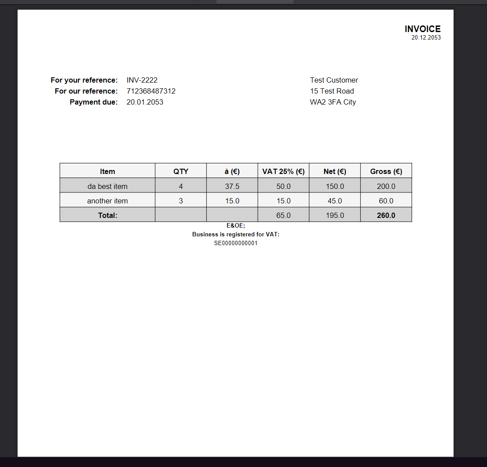

<body id="readme">

[![Contributors][contributors-shield]][contributors-url]
[![Forks][forks-shield]][forks-url]
[![Stargazers][stars-shield]][stars-url]
[![Issues][issues-shield]][issues-url]
[![LinkedIn][linkedin-shield]][linkedin-url]

<!-- site logo -->
 

  

<h3 align="center">Accountspy Preview</h3>

  

    An accounting application in python
     
    <a href="https://rugged-kings-canyon-79210.herokuapp.com/"><strong>Try the app online</strong></a>
     
     
    ·
    <a href="https://github.com/beccauwu/accountspy-preview/issues">Report Bug</a>
    ·
    <a href="https://github.com/beccauwu/accountspy-preview/issues">Request Feature</a>
  

<!-- TABLE OF CONTENTS -->

  
Table of Contents

  <ul id="table-of-contents">
    <li><a href="#introduction">1. Introduction</a></li>
    <li>
      <a href="#styling">2. Functionality in detail</a>
      <ul>
        <li>
          <a href="#colours-and-fonts">2.1. Recording a sale</a>
        </li>
        <li>
        <a href="#pages">2.2 Recording a purchase</a>
        </li>
        <li>
        <a href="#pages">2.2 Recording a sales receipt</a>
        </li>
        <li>
        <a href="#pages">2.2 Recording a purchase payment</a>
        </li>
      </ul>
    </li>
    <li>
    <a href="#testing">3. Testing</a>
      <ul>
        <li><a href="#methods">3.1. Methodology and Results</a></li>
        <li><a href="#issues">3.2. Issues During Testing</a></li>
      </ul>
    </li>
    <li><a href="#bugs">4. Bugs</a></li>
    <li><a href="#deployment">5. Deployment</a></li>
    <li><a href="#future-enhancements">6. Future Enhancements</a></li>
    <li><a href="#contact">7. Contact</a></li>
    <li><a href="#credits">8. Credits</a></li>
  </ul>

<!-- Introduction -->
<h2 id="introduction">1. Introduction</h2>

[![Product Name Screen Shot][product-screenshot]](https://beccauwu.github.io/accountspy-preview)

Accountspy Preview is a demo app for a fully functioning and configurable accounting app I will make in the future.

**Features:**
* Post sales/purchases data into relevant general ledger accounts/control accounts
* Register receipts/payments for credit transactions
* Show current stock balance for products sold
* Calculate profit margins for products as well as total

(<a href="#top">back to top</a>)

<!-- Styling -->
<h2 id="styling">2. Features</h2>

Upon starting the app, the user is prompted with the 4 options below. I will now explain what happens 'behind the scenes' with each of the options.

<h3 id="colours-and-fonts"> 2.1. Recording sales transactions</h3>

When recording sales transactions, the user inputs the transaction date, what products were sold and what the quantities of these products were. The user is also asked whether the sale was on credit or if it the customer paid with cash. If it was on credit, the app creates an invoice for the purchase and uploads it to a folder on Google Drive. In either case the app generates a random transaction ID, enters the transaction data into the relevant ledger accounts, and updates inventory data in their respective worksheets on Google Sheets.

<h3 id="colours-and-fonts"> 2.2. Recording Purchase transactions</h3>

When recording purchase transactions, the process is largely similar to sales transactions, with the difference being the option to register the purchase of non-current assets. If the purchase was on credit, the user inputs the supplier invoice number. A randomised transaction ID is also generated, after which the data is entered to the relevant worksheets.

<h3 id="colours-and-fonts"> 2.3. Recording Purchase transactions</h3>

<h3 id="colours-and-fonts"> 2.4. Recording Purchase transactions</h3>

<h3 id="pages">2.5. Dependencies</h3>

* Collections

    Namedtuple from Collections is used for data management when creating an invoice.

* Google Drive API

    Google Drive API is used to upload files to Google Drive.

* GSpread

    Gspread is used to update worksheets with data and creating worksheets.

* Progress

    ChargingBar from Progress is used to provide feedback on the sometimes slow updates to worksheets.

* Reportlab

    Reportlab is used for generating invoices as PDF files.

<h2 id="testing">3. Testing</h2>

<h3 id="methods">3.1. Methodology and Results</h3>

All the app functionality has been tested thoroughly and the code has been passed through pylint without issues.

<h2 id="bugs">4. Bugs</h2>

**Fixed**

Bug: App appended a line in the spreadsheet it was writing to instead of writing on the same line as the existing text was on.

Fix: Modify function that adds to sheet, to instead of using GSpread append_row use sheet.update where the data is written to the existing sheet values. The updated values then replaces the original values.

Bug: When generating a transaction ID the app got stuck in a loop

Fix: Change indentation of the return statement inside function

**Persistent**

Bug: 

<h2 id="deployment">5. Deployment</h2>

I deployed the page on Heroku via the following procedure:

1. From the project's repository, go to the Settings tab.
2. From the left-hand menu, select the Pages tab.
3. Under the Source section, select the Main branch from the drop-down menu and click Save.
4. A message will be displayed to indicate a successful deployment to GitHub pages and provide the live link.

You can find the live site via the following URL - [Snake live webpage](https://beccauwu.github.io/accountspy-preview)

<h2 id="future-enhancements">6. Future Enhancements</h2>

I will be working on the full version of the app in the future, where all functionality will be user configurable through the use of classes. I didn't see this as practical for this app as for demonstration purposes, most data would have to be preconfigured. In the full version there will be features I wasn't able to include here, which would perhaps make the app practical for some medium-sized businesses. Examples of planned features:

* Ability to create a full range of business documents, not only invoices
* Added GUI
* Excel support
* Configurable accounts

On top of these it would be fully possible to add the possibilities for integration with Electronic Fund Transfer at Point Of Sale (EFTPOS) systems, as well as add automated emails for a variety of functions including:

* Sending invoices to customers
* Overdue invoices follow-ups

<!-- CONTACT -->
<h2 id="contact">7. Contact</h2>

Rebecca Perttula - [@uwuphoto](https://twitter.com/uwuphoto) - rebecca@perttula.co

Project Link: [https://beccauwu.github.io/accountspy-preview](https://beccauwu.github.io/accountspy-preview)

(<a href="#top">back to top</a>)

<!-- Credits -->
<h2 id="credits">8. Credits</h2>

* **Richard Wells**
  
  My Code Institute mentor who has helped me tremendously throughout the project, giving tonnes of amazing advice and helped me figure out the solution to several difficult issues.

(<a href="#top">back to top</a>)

</body>

<!-- MARKDOWN LINKS & IMAGES -->
<!-- https://www.markdownguide.org/basic-syntax/#reference-style-links -->
[contributors-shield]: https://img.shields.io/github/contributors/beccauwu/accountspy-preview.svg?style=for-the-badge
[contributors-url]: https://github.com/beccauwu/my-site/graphs/contributors
[forks-shield]: https://img.shields.io/github/forks/beccauwu/accountspy-preview.svg?style=for-the-badge
[forks-url]: https://github.com/beccauwu/my-site/network/members
[stars-shield]: https://img.shields.io/github/stars/beccauwu/accountspy-preview.svg?style=for-the-badge
[stars-url]: https://github.com/beccauwu/my-site/stargazers
[issues-shield]: https://img.shields.io/github/issues/beccauwu/accountspy-preview.svg?style=for-the-badge
[issues-url]: https://github.com/beccauwu/my-site/issues
[linkedin-shield]: https://img.shields.io/badge/-LinkedIn-black.svg?style=for-the-badge&logo=linkedin&colorB=555
[linkedin-url]: https://linkedin.com/in/rebeccaperttula
[product-screenshot]: assets/images/amiresponsive.png
<!-- Site Captures -->
[index]: assets/images/index.png
[footer]: assets/images/footer.png
[controls]: assets/images/controls.png
[controls-landscape]: assets/images/controlswscore.png
[landscape]: assets/images/landscape.png
[portrait]: assets/images/portrait.png
[dead]: assets/images/death.png
[leaderboard]: assets/images/leaderboard.png
[colours]: assets/images/colours.png
[lighthouse]: assets/images/lighthouse.png

