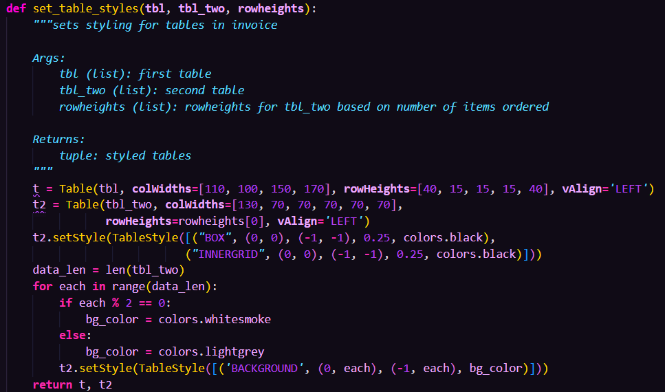

[![Contributors][contributors-shield]][contributors-url]
[![Forks][forks-shield]][forks-url]
[![Stargazers][stars-shield]][stars-url]
[![Issues][issues-shield]][issues-url]
[![LinkedIn][linkedin-shield]][linkedin-url]

<!-- site logo -->
 

  

<h3 align="center">Accountspy Preview</h3>

  

    An accounting application in python
     
    <a href="https://rugged-kings-canyon-79210.herokuapp.com/"><strong>Try the app online</strong></a>
     
     
    ·
    <a href="https://github.com/beccauwu/accountspy-preview/issues">Report Bug</a>
    ·
    <a href="https://github.com/beccauwu/accountspy-preview/issues">Request Feature</a>
  

<!-- TABLE OF CONTENTS -->

  
Table of Contents

  <ul id="table-of-contents">
    <li><a href="#introduction">1. Introduction</a></li>
    <li>
      <a href="#features">2. Features</a>
      <ul>
        <li>
          <a href="#transactions">2.1. Recording Transactions</a>
        </li>
        <li>
        <a href="#statistics">2.2 Statistics</a>
        </li>
        <li>
        <a href="#end">2.3 End</a>
        </li>
        <li>
        <a href="#database">2.4 Database Structure</a>
        </li>
      </ul>
    </li>
    <li><a href="#dependencies">3. Dependencies</a></li>
    <li><a href="#testing">4. Testing</a></li>
    <li><a href="#bugs">5. Bugs</a></li>
    <li><a href="#deployment">6. Deployment</a></li>
    <li><a href="#future-enhancements">7. Future Enhancements</a></li>
    <li><a href="#credits">8. Credits</a></li>
    <li><a href="#links">9. Links</a></li>
  </ul>

<!-- Introduction -->
<h1 id="introduction">1. Introduction</h2>

[![start menu screenshot][start]](https://beccauwu.github.io/accountspy-preview)

Before I started learning development I studied accountancy on my own time. I still love every aspect of it and writing code for software is really fun too. So I thought I would combine these two into an accounting software writen in Python. This is only somewhat of a demo-app - I realised when writing this that I would really like to try making something bigger out of the concept.
Accounting software is notoriously expensive, often leaving small and medium sized businesses unable or struggling to afford the software they need to be able to comply with different kinds of regulations. 

Having this in mind, I dreamt up the idea of an open source accounting software - fully configurable and relatively easy to use. Accountspy-preview showcases some of the features such an app would have with some of the most useful features in an accounting software. The features are largely centered around bookkeeping but there are also a couple of statistical tools which are the most useful for a business to know on the press of a button.

**Features:**
* Post sales/purchases data into relevant general ledger accounts/control accounts
* Register receipts/payments for credit transactions
* Show current stock balance for products sold
* Calculate profit margins for products as well as in total

(<a href="#top">back to top</a>)

<!-- Styling -->
<h1 id="features">2. Features</h1>

Upon starting the app, the user is prompted with the 6 different options:

<h2 id="transactions"> 2.1. Recording Transactions</h2>

**1. Sales Transactions**

![screenshot of sales option][sales]

When recording sales transactions, the user inputs the transaction date, what products were sold and what the quantities of these products were. The user is also asked whether the sale was on credit or if it the customer paid with cash. If it was on credit, the app creates an invoice for the purchase and uploads it to a folder on Google Drive. In either case the app generates a random transaction ID, enters the transaction data into the relevant ledger accounts, and updates inventory data in their respective worksheets on Google Sheets.

**2. Purchase Transactions**

![screenshot of purchases option][purchases]

When recording purchase transactions, the process is largely similar to sales transactions, with the difference being the option to register the purchase of non-current assets. If the purchase was on credit, the user inputs the supplier invoice number. A randomised transaction ID is also generated, after which the data is entered to the relevant worksheets.

**3. Sales Receipts**

![screenshot of sales receipts option][sales-receipts]

When recording a sales receipt, i.e. the receipt of an invoice payment from a customer, the user chooses the customer from whom they received the payment. Upon doing this, they will be prompted with all the invoices from the customer. They type in the invoice number and the amount received after which the receipt is updated into the relevant accounts.

**4. Purchase Payments**

![screenshot of purchase payments option][purchase-payments]

When recording a purchase payment, i.e. the payment of a supplier invoice, the process is largely as that of the Sales Receipts'. The customer is prompted with their suppliers, and then the invoices in that supplier's account. The user enters this information after which the payment is updated into the relevant accounts.

<h2 id="statistics"> 2.2. Statistics</h2>

**5. Inventory status**

![screenshot of inventory status option][inventory]

When checking the inventory status the user is presented with the amount of all the different products currently in stock.

**6. Profit margins**

![screenshot of profit margins option][profit-margin]

The profit margins for each product as well as the overall profit margin is calculated and shown using the formula:

$\textrm{Profit margin} = \frac{\textrm{Sold value} - \textrm{Bought value}}{\textrm{Bought Value}} \times 100\%$

<h2 id="end"> 2.3. End</h2>

After the user has input all relevant data and this is posted to the worksheets, or after the app has finished the all the tasks inside the chosen category, the user is asked whether they would like to go back to the start menu or not. If they do not the script stops executing.

<h2 id="database"> 2.4. Database Structure</h2>

Each worksheet in a spreadsheet have the same structure. There are some differences between spreadsheets but the structure is roughly the same.
Columns 1-3 are the debit side with 3 keys and columns 4-6 are the credit side with 3 keys. The keys can vary between spreadsheets.
The exceptions to this format are the worksheets within the database spreadsheet. They are there to just hold data, nothing else so their format depends on the data they hold.

| **Spreadsheet** 	| **Key** 	| **Key** 	| **Key** 	| **Key** 	| **Key** 	| **Key** 	|
|:---:	|:---:	|:---:	|:---:	|:---:	|:---:	|:---:	|
| **Stock** 	| Date 	| Amount Bought 	| Total 	| Date 	| Amount Sold 	| Total 	|
| **Payables** 	| Narrative 	| Invoice NO 	| € 	| Narrative 	| Invoice No 	| € 	|
| **Receivables** 	| Narrative 	| Invoice NO 	| € 	| Narrative 	| Invoice NO 	| € 	|
| **General Ledger** 	| Narrative 	| Ref 	| € 	| Narrative 	| Ref 	| € 	|
| **Database** (Invoice/Transaction ID) 	| Value 	| None 	| None 	| None 	| None 	| None 	|
| **Database** (Addresses) 	| Name 	| Address 	| City 	| Postcode 	| Country 	| None 	|

Below I have detailed what postings happen as a consequence of each type of transaction. Horizontally are the transaction types and vertically the spreadsheets. The data in their cross section represents worksheets in the spreadsheets and whether the transaction is recorded on the debit or credit side in each of them.

| Transaction/ Spreadsheet 	| **Sales, Credit** 	| **Sales, Cash** 	| **Purchases, Credit** 	| **Purchases, Cash** 	| **Sales Receipt** 	| **Purchase Payment** 	|
|:---:	|:---:	|:---:	|:---:	|:---:	|:---:	|:---:	|
| **General Ledger** 	| Trade Receivables (Dr), Current Assets (Cr) 	| Cash (Dr), Sales Tax (Dr), Current Assets (Cr) 	| Trade Payables (Cr), Current/Non-current Assets (Dr) 	| Cash (Cr), Current/Non-current Assets (Dr) 	| Trade Receivables (Cr), Cash (Dr), Sales Tax (Dr) 	| Trade Payables (Dr), Cash (Cr) 	|
| **Payables** 	| None 	| None 	| Supplier Account (Dr) 	| None 	| None 	| Supplier Account (Cr) 	|
| **Receivables** 	| Customer account (Cr) 	| None 	| None 	| None 	| Customer account (Dr) 	| None 	|
| **Stock** 	| Sold item(s) account (Cr) 	| Sold item(s) account (Cr) 	| If current asset: bought item(s) account (Dr) 	| If current asset: bought item(s) account (Dr) 	| None 	| None 	|
| **Database** 	| Invoice NO, Transaction ID 	| Transaction ID 	| Transaction ID 	| Transaction ID 	| Transaction ID 	| Transaction ID 	|

<h1 id="dependencies">3. Dependencies</h1>

* [Collections](https://docs.python.org/3/library/collections.html#module-collections)

    Namedtuple from Collections is used for data management when creating an invoice.

* [Google Drive API](https://developers.google.com/drive/api)

    Google Drive API is used to upload files to Google Drive.

* [GSpread](https://github.com/burnash/gspread)

    Gspread is used to update worksheets with data and creating worksheets.

* [Progress](https://pypi.org/project/progress/)

    ChargingBar from Progress is used to provide feedback on the sometimes slow updates to worksheets.

* [Reportlab](https://www.reportlab.com/)

    Reportlab is used for generating invoices as PDF files.

<h1 id="testing">4. Testing</h1>

**Methodology**

All the app functionality has been tested thoroughly as shown below and the code has been passed through pylint.

**Tests in detail**

---------------

Implementation 🏭: On the different menus, I wanted an input number to redirect to its corresponding function and if an invalid value is entered to show an error message

Test 🧪: I went through all the menus and typed correct and incorrect values in each of them

Result 🏆: All the menus worked as expected, and all of them correctly printed an error message if an invalid value was entered

Verdict ✅: The test passed as everything worked as expected

---------------

Implementation 🏭: When user is asked to input a date, I wanted to ensure the date is possible by checking if the given month has the number of days input, taking into account leap years. I also wanted to ensure the value entered is a date and not another string

Test 🧪: I input incorrect values and dates outside of the range within a given month

Result 🏆: The validation worked as expected, showing errors if the date entered is not possible to exist.

Verdict ✅: The test passed with its current form of validation, changes are required for the user not to be able to input a date too far back in time as the validation is currently not checking for this. Changes are also required to not allow the date to be in the future as this does not make sense from a bookkeeping standpoint.

---------------

Implementation 🏭: When user is asked to select an invoice from a list, prohibit the input of a non-existent invoice by checking if entered invoice exists in the list.

Test 🧪: I input invoices not in the list

Result 🏆: The validation worked as expected, typing an invoice not on the list is not possible

Verdict ✅: The test passed and everything worked as expected

---------------

Implementation 🏭: When generating both a random invoice number and transaction ID, I have the function check if the generated value already exists. If it does, the function generates a new random value until it is unique. The number is then added to a database with its corresponding task

Test 🧪: This is not something that I am able to test as it relies on random numbers, but no duplicate values have been generated so far.

Result 🏆: The validation should work as expected but as said it's not possible for me to see if it actually does

Verdict ✅: I cannot give the test a verdict at this point, however if a value is created which is a duplicate on the list I will know that it doesn't work. Proving a negative isn't possible.

---------------

**Pylint**

I have pylint installed on VSCode so I have been able to sort out problems as they come. There are still some flags which I am aware of but they are not anything that impact the functionality of the app nor are they many times possible to solve easily:

* run.py 
  * **anomalous backslashes:**
    This error is due to the project logo print out at the start using backslashes to draw the logo. It is the best way to do it and I like having the logo there as a buffer when starting the app.
* exportpdf.py
  * **variable name doesn't conform to snake_case naming style:**
    The reason for the variables to be named that is to avoid confusion and in the case of variables 't' and 't2', the preferred names 'tbl' and 'tbl_two' are already being used as parameters in the function which makes it impossible to rename them. Any other names would not be as clear as these are.

<h2 id="bugs">5. Bugs</h2>

**Fixed**

---------------

Bug 🐝: App appended a line in the spreadsheet it was writing to instead of writing on the same line as the existing text was on

Cause 🛠: The append_data function used the worksheet.append_row funtion instead of updating the sheet with new data

Fix 💚: Modify append_data, to instead of using GSpread append_row use sheet.update where the data is written to the existing sheet values. The updated values then replace the original values

---------------

Bug 🐝: When generating a transaction ID the app got stuck in a loop

Cause 🛠: Return statement was indented too much

Fix 💚: Change indentation of the return statement inside function

---------------

Bug 🐝: When creating an invoice, the country of the customer was not printed

Cause 🛠: The formatting of the paragraph string made it not work

Fix 💚: Convert the string to uppercase before adding it to the invoice

---------------

Bug 🐝: When updating worksheet with floats, the value would have an added semicolon in front of it, making calculations made within the worksheet not work

Cause 🛠: I haven't found a cause for it anywhere despite thorough research of gspread docs and asking online

Fix 💚: Move calculations made in worksheet to python where the values could be converted to floats

---------------

<h1 id="deployment">6. Deployment</h1>

I deployed the page on Heroku via the following procedure:

1. Sign up or log in to [heroku dashboard](https://dashboard.heroku.com/)
2. Select 'Create New App'
3. Name the project (must be a unique name), choose your region and click 'Create'
4. Navigate to the settings tab (must be done before deploying code)
5. Add 'Config vars'
6. As key enter 'CREDS'
7. As value paste the contents of your credentials file
8. As key enter 'PORT'
9.  As value enter '8000'
10. Click 'Add Buildpack'
11. Add Python and NodeJS as buidpacks
12. Navigate to the Deploy tab
13. Select GitHub as deployment method and confirm that you want to connect to your repository
14. Enter the name of the repository and click 'connect'
15. Once complete, select 'Automatic Deploys'. As your deployment method. This will create a deployed link which displays a mock terminal.

You can find the live site via the following URL - [accountspy-preview live webpage](https://rugged-kings-canyon-79210.herokuapp.com/)

<h2 id="future-enhancements">7. Future Enhancements</h2>

I will be working on the full version of the app in the future, where all functionality will be user configurable through the use of classes. I didn't see this as practical for this app as for demonstration purposes, most data would have to be preconfigured. In the full version there will be features I wasn't able to include here, which would perhaps make the app practical for some medium-sized businesses. Examples of planned features:

* Ability to create a full range of business documents, not only invoices
* Added GUI
* Excel support
* Configurable accounts

On top of these it would be fully possible to add integrations for Electronic Fund Transfer at Point Of Sale (EFTPOS) systems, and automated emails for a variety of functions including:

* Sending invoices to customers
* Overdue invoice follow-ups

(<a href="#top">back to top</a>)

<!-- Credits -->
<h1 id="credits">8. Credits</h1>

* **Richard Wells**
  
  My Code Institute mentor who has helped me tremendously throughout the project, giving tonnes of amazing advice and helped me figure out the solution to several difficult issues.

(<a href="#top">back to top</a>)

<h1 id="links">9. Links</h1>

* [Database Google Drive folder](https://drive.google.com/drive/folders/1pOgtupYWIjwE0W5tDjbob2cMwOyht9K6?usp=sharing)
* [Invoices Google Drive Folder](https://drive.google.com/drive/folders/1_C-fAnZgSmfio28gpGks6ZPZRlW9G981?usp=sharing)
* [Live app on Heroku](https://rugged-kings-canyon-79210.herokuapp.com/)

<!-- MARKDOWN LINKS & IMAGES -->
<!-- https://www.markdownguide.org/basic-syntax/#reference-style-links -->
[contributors-shield]: https://img.shields.io/github/contributors/beccauwu/accountspy-preview.svg?style=for-the-badge
[contributors-url]: https://github.com/beccauwu/my-site/graphs/contributors
[forks-shield]: https://img.shields.io/github/forks/beccauwu/accountspy-preview.svg?style=for-the-badge
[forks-url]: https://github.com/beccauwu/my-site/network/members
[stars-shield]: https://img.shields.io/github/stars/beccauwu/accountspy-preview.svg?style=for-the-badge
[stars-url]: https://github.com/beccauwu/my-site/stargazers
[issues-shield]: https://img.shields.io/github/issues/beccauwu/accountspy-preview.svg?style=for-the-badge
[issues-url]: https://github.com/beccauwu/my-site/issues
[linkedin-shield]: https://img.shields.io/badge/-LinkedIn-black.svg?style=for-the-badge&logo=linkedin&colorB=555
[linkedin-url]: https://linkedin.com/in/rebeccaperttula
<!-- Site Captures -->
[start]: assets/img/banner.png
[sales]: assets/img/sales.png
[purchases]: assets/img/purchases.png
[sales-receipts]: assets/img/sales-receipts.png
[purchase-payments]: assets/img/purchase-payments.png
[inventory]: assets/img/inventory.png
[profit-margin]: assets/img/profit-margin.png
[invalid-name]: assets/img/invalid-name.png
[old-appd]: assets/img/old-appd.png
[new-appd]: assets/img/new-appd.png
[transaction-id]: assets/img/transaction-id.gif
[semicolon]: assets/img/semicolon.png
[semicolon-fix]: assets/img/semicolon-fix.png